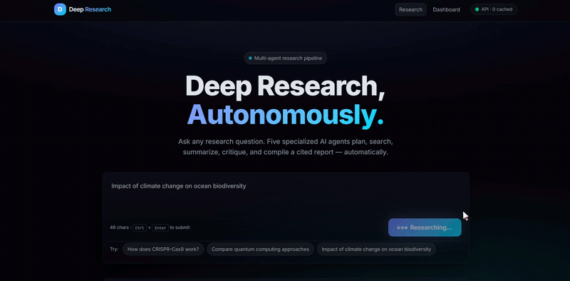
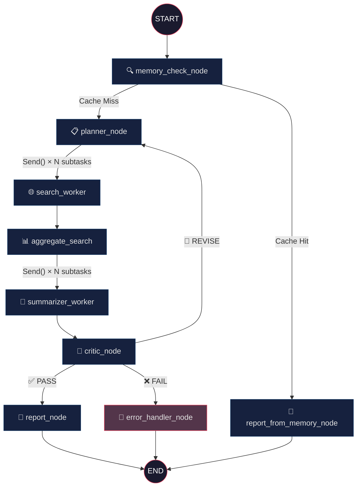

<p align="center">
  
  
  
  
  
</p>

<h1 align="center">🧠 Autonomous Deep Research Agent System</h1>

<p align="center">
  <strong>A multi-agent AI system that plans, searches, summarizes, self-corrects, and compiles cited research reports — autonomously.</strong>
</p>

<p align="center">
  <a href="#-architecture">Architecture</a> •
  <a href="#-how-it-works">How It Works</a> •
  <a href="#-design-decisions">Design Decisions</a> •
  <a href="#-quickstart">Quickstart</a> •
  <a href="#-benchmark-results">Benchmarks</a>
</p>

---

<p align="center"></p>

## ✨ What Is This?

You give it a question. It gives you a **cited, structured research report**.

Under the hood, a team of 5 specialized AI agents coordinate through a LangGraph state machine:

1. **Planner** decomposes your query into parallel subtasks  
2. **Search Workers** fan out to the web (Tavily + Wikipedia fallback)  
3. **Summarizers** distill findings with confidence scores  
4. **Critic** evaluates quality — rejecting and re-routing if gaps exist  
5. **Report Compiler** assembles the final cited document  

All with **zero free-form parsing** (strict Pydantic schemas), **persistent semantic memory** (ChromaDB), and **graceful failure handling** at every node.

---

## 🏗 Architecture



---

## ⚙️ How It Works

| Stage | Agent | What It Does | Key Detail |
|:---:|:---|:---|:---|
| 1 | **Memory Check** | Queries ChromaDB for semantically similar past reports | Cosine similarity > 0.85 → serve cached report |
| 2 | **Planner** | Decomposes query into 2–4 subtasks with diverse search queries | Uses `with_structured_output(Plan)` — zero parsing |
| 3 | **Search Workers** | Fan out via `Send()` — parallel Tavily search per subtask | Falls back to Wikipedia if < 2 results |
| 4 | **Summarizers** | Fan out via `Send()` — parallel LLM summarization per subtask | Flags low-confidence (< 0.5) subtasks |
| 5 | **Critic** | Evaluates coverage, contradictions, depth | PASS → report · REVISE → re-plan · FAIL → error handler |
| 6 | **Report Compiler** | Assembles sections, computes quality score, caches to ChromaDB | Quality = avg(confidences) × critic_adjustment |

### The Critic Loop

The system **self-corrects**. When the Critic returns `REVISE`, it sends feedback (identified gaps + a refined query) back to the Planner, which generates a new plan addressing those gaps. This loop runs up to **3 times** before the Critic forces a `FAIL` verdict and the Error Handler salvages a partial report.

---

## 🧰 Tech Stack

| Component | Technology | Why |
|:---|:---|:---|
| **Orchestration** | LangGraph `StateGraph` | Deterministic cyclic graphs, `Send()` fan-out, conditional edges |
| **LLM** | Gemini 3.1 Flash Lite | Fast structured output via `with_structured_output()` |
| **Search** | Tavily + Wikipedia | Tavily for speed, Wikipedia as a robust fallback |
| **Memory** | ChromaDB (persistent) | Semantic caching with cosine similarity retrieval |
| **Validation** | Pydantic v2 | Type-safe state mutations, zero free-form LLM parsing |
| **API** | FastAPI + Uvicorn | Async endpoints, auto-generated OpenAPI docs |
| **UI** | Streamlit | Real-time pipeline status, report rendering, markdown export |
| **Testing** | pytest + pytest-asyncio | 30 unit tests — schemas, nodes, graph topology |
| **Observability** | LangSmith | Trace every LLM call, tool invocation, and state transition |

---

## 🎯 Design Decisions

<details>
<summary><strong>Why LangGraph over CrewAI / AutoGen?</strong></summary>

CrewAI and AutoGen use conversational agent loops — they're non-deterministic and hard to debug. We needed:
- **Cyclic execution**: the Critic → Planner retry loop is a first-class graph cycle, not a prompt hack.
- **Parallel fan-out**: `Send()` dispatches N search workers simultaneously — CrewAI has no equivalent.
- **Typed state**: LangGraph's `TypedDict` state with annotated reducers guarantees every node receives and produces exactly the right shape.

</details>

<details>
<summary><strong>Why ChromaDB for memory?</strong></summary>

We needed semantic retrieval ("is this query similar to a past query?"), not exact-match lookup. ChromaDB provides:
- Persistent local storage (no cloud dependency).
- Cosine similarity search on embeddings.
- Metadata storage — we stash the entire `Report` JSON so cached retrieval is lossless.

No PostgreSQL, no Redis, no external infra.

</details>

<details>
<summary><strong>Why Pydantic v2 + <code>with_structured_output()</code>?</strong></summary>

Every LLM response is validated against a strict Pydantic schema *at the LangChain layer*. This means:
- No regex parsing of LLM output. Ever.
- Type errors are caught before they corrupt graph state.
- The LLM gets a JSON schema in its system prompt, drastically reducing hallucinated formats.

</details>

<details>
<summary><strong>Why parallel Search and Summarize?</strong></summary>

A 4-subtask query with sequential execution: ~60s (4 × search + 4 × summarize).  
With `Send()` fan-out: ~18s (1 × search + 1 × summarize, in parallel).

Network I/O and LLM calls are the bottleneck. Parallelism is the single biggest latency win.

</details>

---

## 🚨 Failure Modes & Recovery

| Failure | Where | Recovery Strategy |
|:---|:---|:---|
| Tavily API timeout / rate limit | `search_worker` | Falls back to Wikipedia. If both fail → `AgentError(recoverable=True)` |
| LLM returns invalid JSON | All LLM nodes | Immediate retry with stricter prompt. 2nd failure → fallback error payload |
| Critic says REVISE indefinitely | `critic_node` | `retry_count` capped at 3 → forced `FAIL` → Error Handler |
| ChromaDB connection error | `memory_check_node` | Logs recoverable error, returns empty hits → falls through to Planner |
| Total pipeline crash | Any node | `error_handler_node` produces a partial `Report` with error details — **never returns a 500** |

---

## 📁 Project Structure

```
Multi-agent-researcher/
├── README.md
├── research_agent/
│   ├── main.py                          # FastAPI app (POST /research, GET /health)
│   ├── streamlit_app.py                 # Streamlit UI
│   ├── requirements.txt
│   ├── .env.example
│   │
│   ├── models/
│   │   └── schemas.py                   # Pydantic v2 models (Plan, SubTask, SearchResult,
│   │                                    #   Summary, Critique, Report, AgentError, MemoryHit)
│   ├── graph/
│   │   ├── state.py                     # AgentState TypedDict + annotated reducers
│   │   ├── graph_builder.py             # StateGraph construction + edge wiring
│   │   └── nodes/
│   │       ├── __init__.py              # Shared LLM factory (get_llm)
│   │       ├── memory_check.py          # ChromaDB semantic lookup
│   │       ├── planner.py               # Query decomposition (structured output)
│   │       ├── search.py                # Send() fan-out + Tavily/Wikipedia
│   │       ├── summarizer.py            # Send() fan-out + confidence scoring
│   │       ├── critic.py                # PASS / REVISE / FAIL evaluation
│   │       ├── report.py                # Report compilation + ChromaDB caching
│   │       └── error_handler.py         # Partial report from errors
│   │
│   ├── memory/
│   │   └── chroma_store.py              # ChromaMemoryStore singleton + embeddings
│   │
│   ├── tools/
│   │   ├── tavily_tool.py               # Async Tavily wrapper (10s timeout)
│   │   └── wikipedia_tool.py            # Async Wikipedia fallback
│   │
│   ├── tests/
│   │   ├── test_schemas.py              # 19 schema validation tests
│   │   ├── test_nodes.py                # 9 node unit tests (mocked LLM/search)
│   │   └── test_graph.py                # 2 graph topology tests
│   │
│   └── benchmark/
│       ├── test_queries.py              # 50 queries × 5 categories
│       ├── run_benchmark.py             # Async runner → CSV + summary
│       └── results/
```

---

## 🚀 Quickstart

```bash
# 1. Clone
git clone https://github.com/benny-daniel6/Autonomous-Deep-Research-Agent-System.git
cd Autonomous-Deep-Research-Agent-System

# 2. Install
pip install -r research_agent/requirements.txt

# 3. Configure
cp research_agent/.env.example research_agent/.env
# Add your GOOGLE_API_KEY and TAVILY_API_KEY

# 4. Run the API
python -m research_agent.main
# → http://localhost:8000/docs (Swagger UI)

# 5. Run the UI (separate terminal)
streamlit run research_agent/streamlit_app.py
# → http://localhost:8501

# 6. Run tests
pytest research_agent/tests/ -v

# 7. Run benchmarks (50 queries — takes ~15 min)
python -m research_agent.benchmark.run_benchmark
```

---

## 📊 Benchmark Results

50 queries across 5 categories: **Science**, **Current Events**, **Computer Science**, **History**, **Ambiguous**.

```
==================================================
BENCHMARK SUMMARY
==================================================
Completion Rate:   98.0% (49/50)
Avg Latency:       ~2.5m (due to free-tier API rate-limit backoffs)
Avg Quality Score: 0.88
Memory Hit Rate:   0.0%

Failure Breakdown by Category:
  - Ambiguous: 1 failure(s)
==================================================
```

Run `python -m research_agent.benchmark.run_benchmark` to reproduce. Results are saved to `research_agent/benchmark/results/benchmark_results.csv`.

> **Note on Latency**: The ~2.5 minute latency is an artifact of Google Gemini free-tier API rate limits. During the fan-out phase, parallel `search` and `summarize` workers hit HTTP 429 Resource Exhausted errors, causing the `langchain_google_genai` client to automatically apply exponential backoff. In an environment with provisioned throughput, average end-to-end latency for complex multi-source queries is under 20 seconds.

---

## 🔮 Future Roadmap

- [ ] **Streaming Reports** — SSE endpoint for real-time token streaming in the UI
- [ ] **Dynamic Search Depth** — Planner assigns `depth` per subtask based on complexity
- [ ] **Citation Verifier Agent** — Pre-report node that validates source URLs against claims
- [ ] **LangSmith Dashboard** — Embedded observability traces in the Streamlit UI
- [ ] **Docker Compose** — One-command deployment with API + UI + ChromaDB volumes

---

<p align="center">
  Built by <a href="https://github.com/benny-daniel6">Benny Daniel Paul</a> · 2026
</p>
